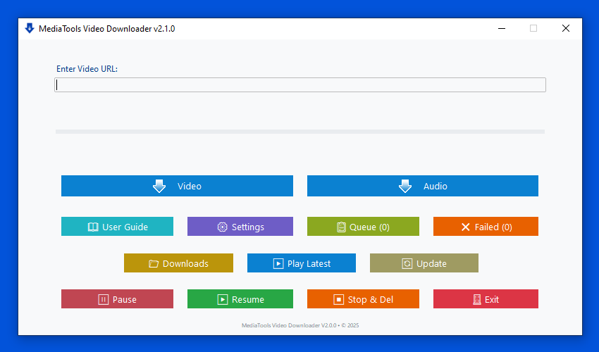

# MediaTools Video Downloader

A cross-platform video and audio downloader application for downloading media from various platforms. For complete list of supported sites, check [yt-dlp documentation](https://github.com/yt-dlp/yt-dlp).

## Table of Contents

- [About](#about)
- [What's New in v2.1.0](#whats-new-in-v210)
- [Features](#features)
- [System Requirements](#system-requirements)
- [Installation](#installation)
- [Quick Start](#quick-start)
- [Documentation](#documentation)
- [Dependencies](#dependencies)
- [Support](#support)
- [License](#license)
- [Legal Disclaimer](#️-legal-disclaimer)
- [Credits](#credits)

## About

MediaTools Video Downloader is a user-friendly desktop application that allows you to download videos and audio in various formats and quality settings. The application provides an intuitive interface for managing downloads, organizing media files, and configuring download preferences.

## What's New in v2.1.0

- **New Dependencies**: Now includes `spotdl` (for Spotify) and `deno` alongside `yt-dlp` and `ffmpeg`, all automatically managed by the application.
- **Code Refactoring**: Major refactoring for better modularity and maintainability.
- **Improved Playlist Progress**: Better status display for playlist downloads.

## Features

### Video Download

- **Auto Update**: Keeps `yt-dlp`, `spotdl`, `deno`, `FFmpeg` and the application up-to-date.
- **Wide Platform Support**: Download videos from over 1000 platforms.
- **Multiple Format Support**: MKV, MP4, and more.
- **Quality Selection**: Choose from best quality or custom formats.
- **Download Speed Control**: Manage download bandwidth.
- **Custom Download Location**: Set your preferred download folder.
- **Queue Management**: For batch downloads.
- **Thumbnail Embedding**: Automatically embed thumbnails.
- **Cookie Support**: For downloading private videos.
- **Cross-Platform Compatibility**: Windows and Linux support.
- **Smart Format Fallback**: Ensures downloads complete successfully.

### Audio Download

- **Extract Audio**: Rip audio from video files.
- **Multiple Audio Formats**: M4A, MP3, or Best Audio.
- **Thumbnail/Cover Art Embedding**: For better media organization.
- **Dedicated Audio Folder**: Automatically organizes audio files.
- **Audio-Specific Queue Management**: Prioritize and manage audio downloads.
- **Quality Preservation**: Keep audio quality intact.

### Advanced Features

- **Queue Persistence**: Your download queue is saved between sessions.
- **Failed URL Tracking**: Keep track of downloads that failed.
- **Platform-Specific Folder Organization**: Organize downloads by platform.
- **Browser Cookie Integration**: For seamless private video downloads.
- **Download Archive**: Avoid downloading duplicate files.

## System Requirements

- **Operating System**: Windows 10/11, Ubuntu 20.04+
- **macOS**: *Coming soon*
- **Dependencies**:
  - `yt-dlp` (automatically managed)
  - `spotdl` (automatically managed)
  - `deno` (automatically managed)
  - `FFmpeg` (automatically managed)

## Installation

1. Download the latest release for your platform.
2. Run the executable file:
   - **Windows**: `mt-vdl.exe`
   - **Linux**: `mt-vdl` (make it executable with `chmod +x mt-vdl`)
3. The application will automatically download the required dependencies on the first run.
4. Follow the on-screen setup wizard.

## Quick Start

1. Launch MediaTools Video Downloader.
2. Paste a video URL in the input field.
3. Select your preferred format and quality.
4. Click **Download**.
5. Media files are saved to the configured downloads folder.

## Documentation

For detailed usage instructions, feature descriptions, and troubleshooting:

- See **UserGuide.pdf** in the application folder.
- Or access the **Guide** menu within the application.
- Complete documentation: [docs/UserGuide.md](docs/UserGuide.md)

## Dependencies

This application uses:

- **yt-dlp**: Video downloading engine ([https://github.com/yt-dlp/yt-dlp](https://github.com/yt-dlp/yt-dlp))
- **spotdl**: Spotify downloading engine ([https://github.com/spotdl/spotdl](https://github.com/spotdl/spotdl))
- **deno**: A modern runtime for JavaScript and TypeScript ([https://deno.land/](https://deno.land/))
- **FFmpeg**: Media processing ([https://ffmpeg.org](https://ffmpeg.org))

All are automatically downloaded and managed by the application.

## Support

For issues, questions, or feature requests:

- **GitHub Issues**: [https://github.com/MediaTools-tech/mediatools/issues](https://github.com/MediaTools-tech/mediatools/issues)
- **Email**: [bala.lv.555@gmail.com](mailto:bala.lv.555@gmail.com)
- **Website**: [mediatools.tech](https://mediatools.tech)

## License

This project is licensed under the MIT License - see the [LICENSE](LICENSE) file for details.

## ⚠️ Legal Disclaimer

This software is a GUI tool for `yt-dlp` and `spotdl`. Users are solely responsible for complying with copyright laws and platform terms of service. Only download content you have permission to access.

## Credits

- **Developed by**: Bala
- **Organization**: MediaTools
- **Website**: [mediatools.tech](https://mediatools.tech)
- **GitHub**: [https://github.com/MediaTools-tech/mediatools](https://github.com/MediaTools-tech/mediatools)

---

**Version**: 2.1.0  
Copyright (c) 2026 MediaTools. All rights reserved.
