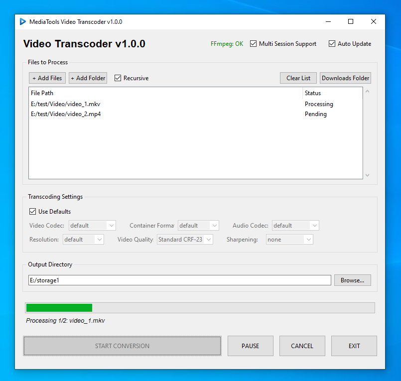

# MediaTools Video Transcoder - User Guide

## Comprehensive Documentation

**Version:** 1.0.0  
**Developer:** Bala  
**Organization:** MediaTools  
**GitHub:** <https://github.com/MediaTools-tech/mediatools>  
**Website:** <https://mediatools.tech>

---

## Table of Contents

1. [Introduction](#1-introduction)
2. [Installation & Setup](#2-installation--setup)
3. [Interface Overview](#3-interface-overview)
4. [Transcoding Process](#4-transcoding-process)
5. [Advanced Settings](#5-advanced-settings)
6. [Queue Management](#6-queue-management)
7. [Updates & Maintenance](#7-updates--maintenance)
8. [Troubleshooting & FAQ](#8-troubleshooting--faq)

---

## 1. Introduction

MediaTools Video Transcoder is a streamlined, professional desktop application designed for high-quality video conversion. Built as a native GUI for FFmpeg, it combines ease of use with powerful batch-processing capabilities.

### Key Features

- **Modern Codec Support**: H.264, H.265 (HEVC), AV1, and VP9.
- **Batch Processing**: Convert hundreds of files recursively with one click.
- **Professional Filtering**: Built-in CAS (Contrast Adaptive Sharpening) and Unsharp filters.
- **Smart Queue**: Right-click to reorder tasks; progress persists across restarts.
- **Zero Configuration**: Automatically manages FFmpeg binaries for you.

](./images/transcoder_screenshot.png)

---

## 2. Installation & Setup

### 2.1 System Requirements

- **Windows**: 10 or 11 (64-bit).
- **Linux**: Standard distributions (Ubuntu 20.04+).
- **Disk Space**: ~200MB for application + space for processed videos.

### 2.2 First Run

On your first launch, the application will:

1. Check for **FFmpeg**.
2. Prompt to download it if missing.
3. Automatically configure paths.
4. Set up an optional desktop shortcut.

---

## 3. Interface Overview

### 3.1 File List (Queue)

This is where your pending tasks live.

- **+ Add Files**: Select individual videos.
- **+ Add Folder**: Select a directory for batch processing.
- **Recursive**: Toggle this to include videos in subfolders.
- **Clear List**: Empty the entire queue.
- **Right-Click**: Access the context menu to move items UP, DOWN, to the TOP, to the BOTTOM, or REMOVE them. If an item is **Cancelled**, you can also select **Enqueue Again** to reset it and move it to the end of the list.

### 3.2 Transcoding Settings

- **Video Codec**: Choose your encoding standard.
- **Container Format**: Select MP4, MKV, etc.
- **Audio Codec**: Choose "Copy" to keep original audio or re-encode.
- **Resolution**: Scale your video (e.g., 1080p, 720p) or keep original.
- **Video Quality**: Select quality presets which adjust the Constant Rate Factor (CRF).

---

## 4. Transcoding Process

1. **Add Media**: Use the buttons to populate the list.
2. **Configure**: Select your codec and container.
3. **Pick Output**: Verify the "Output Directory" path.
4. **Start**: Click **START CONVERSION**.
5. **Monitor**: Watch the status bar and overall progress.

### Automatic Naming

The app never overwrites your original files. If a file name exists in the output folder, the app will automatically name the new one `filename_1.mp4`, `filename_2.mp4`, etc.

---

## 5. Advanced Settings

### 5.1 Constant Rate Factor (CRF)

We offer simplified quality settings:

- **High Quality (CRF 20)**: Near-lossless, larger files.
- **Standard (CRF 23)**: Best balance, default.
- **Low Quality (CRF 27)**: Aggressive compression, smallest files.

### 5.2 Sharpening Filters

- **Unsharp**: Classical sharpening for softening effects.
- **CAS (Contrast Adaptive Sharpening)**: Modern, edge-aware sharpening that preserves detail without looking "artificial."

---

## 6. Queue Management

### 6.1 Interactive Controls

Right-click any item in the list to:

- **Move to Top**: Instantly prioritize a file.
- **Move Up/Down**: Fine-tune the processing order.
- **Remove**: Delete a specific item from the list.

### 6.2 Session Support

If you close the application while tasks are pending, the **Multi-Session Support** (enabled by default) will reload your queue exactly as you left it the next time you open the app.

---

## 7. Updates & Maintenance

### 7.1 Auto-FFmpeg

The app checks for FFmpeg updates every **28 days**. If a new version is available, it will prompt you to update. You can manually trigger a check by clicking the status label or the update logic in the header.

### 7.2 Clear Data

To reset the app to factory settings, delete the `settings.json` and `queue.txt` files found in your `AppData` (Windows) or `.config` (Linux) folder.

---

## 8. Troubleshooting & FAQ

**Q: Why is my transcoding so slow?**  
A: Transcoding is a CPU-intensive task. Higher codecs like H.265 or AV1 take significantly longer than H.264.

**Q: Where can I find my finished videos?**  
A: Click the **Downloads Folder** button in the app to open the output directory in File Explorer.

**Q: How do I stop or exit?**  
A: Click **CANCEL** to stop the current batch, or **EXIT** to safely close the application.

**Q: The app closed unexpectedly!**  
A: Don't worry. Your queue is saved. Re-open the app, and you can resume where you left off.

---

Copyright (c) 2026 MediaTools. All rights reserved.
